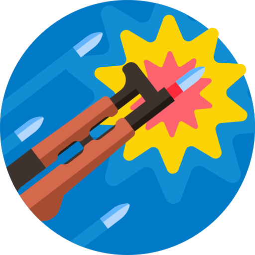

<p align="center">

</p>
<h1 align="center">akm-next</h1>

[](#)

<!-- ALL-CONTRIBUTORS-BADGE:START - Do not remove or modify this section -->

[](#contributors)

<!-- ALL-CONTRIBUTORS-BADGE:END -->

[](https://vercel.com/new/git/external?repository-url=https://github.com/iffa/next-starter)

Find affordable games and downloadable content from dozens of stores with zero hassle.

## Built with

- [Next.js](https://nextjs.org/)
- [Tailwind CSS](tailwindcss.com/) for styling
- An assortment of third-party libraries, such as [next-i18next](https://github.com/isaachinman/next-i18next/), [next-seo](https://github.com/garmeeh/next-seo) and [next-sitemap](https://github.com/iamvishnusankar/next-sitemap)
- End-to-end testing with [Cypress](https://www.cypress.io/)
- A bunch of tools for a better dev experience, including [ESLint](https://eslint.org/), [Prettier](https://prettier.io/) and [commitlint](https://commitlint.js.org)
- One-click deploy to [Vercel](https://vercel.com)

## Getting Started

```bash
git clone git@github.com:iffa/akm-next.git

cd akm-next

npm install

# create .env.local and add environment variables (see .env.example)
touch .env.local

npm run dev
```

Open [http://localhost:3000](http://localhost:3000) with your browser to see the result.

The `pages/api` directory is mapped to `/api/*`. Files in this directory are treated as [API routes](https://nextjs.org/docs/api-routes/introduction) instead of React pages.

## Learn More

To learn more about Next.js, take a look at the following resources:

- [Next.js Documentation](https://nextjs.org/docs) - learn about Next.js features and API.
- [Learn Next.js](https://nextjs.org/learn) - an interactive Next.js tutorial.

You can check out [the Next.js GitHub repository](https://github.com/vercel/next.js/) - your feedback and contributions are welcome!

## Deploy on Vercel

The easiest way to deploy your Next.js app is to use the [Vercel Platform](https://vercel.com/new/git/external?repository-url=https://github.com/iffa/next-starter) from the creators of Next.js.

Check out our [Next.js deployment documentation](https://nextjs.org/docs/deployment) for more details.

## Credits

Products and search powered by [Allkeyshop.com](allkeyshop.com/).

Favicon made by <a href="https://www.freepik.com" title="Freepik">Freepik</a> from <a href="https://www.flaticon.com/" title="Flaticon">www.flaticon.com</a>.

## Contributors ✨

Thanks goes to these wonderful people ([emoji key](https://allcontributors.org/docs/en/emoji-key)):

<!-- ALL-CONTRIBUTORS-LIST:START - Do not remove or modify this section -->
<!-- prettier-ignore-start -->
<!-- markdownlint-disable -->
<table>
  <tr>
    <td align="center"><a href="https://iffa.dev"><br /><sub><b>Santeri Elo</b></sub></a><br /><a href="https://github.com/iffa/akm-next/commits?author=iffa" title="Code">💻</a></td>
  </tr>
</table>

<!-- markdownlint-restore -->
<!-- prettier-ignore-end -->

<!-- ALL-CONTRIBUTORS-LIST:END -->
